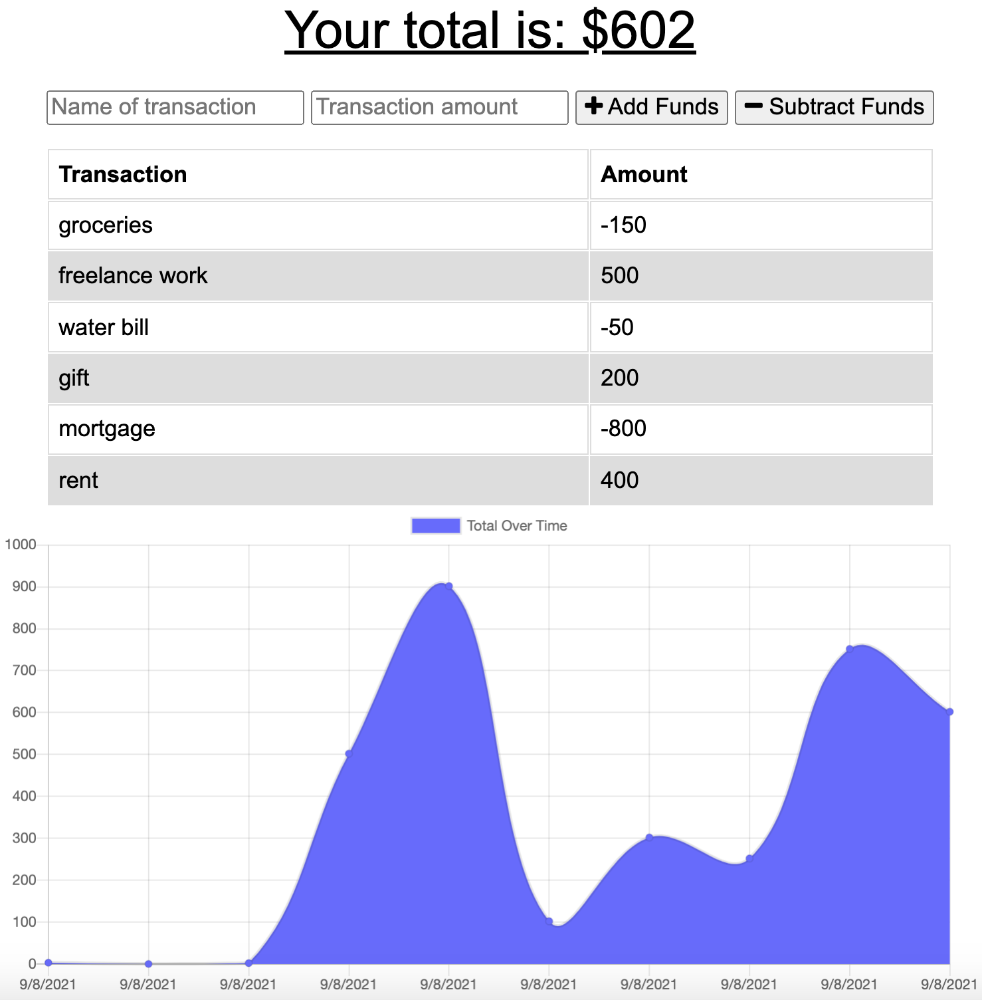

# Budget Tracker
AS AN avid traveler
I WANT to be able to track my withdrawals and deposits with or without a data/internet connection
SO THAT my account balance is accurate when I am traveling

## Table of Contents
* [How it works](#how-it-works)
* [Features](#features)
* [Technoliges Used](#technologies-used)
* [Deployed URL](#deployed-url)

## How it works:
- Add name of transaction and transaction amount
- Click *Add Funds* OR *Subtract Funds*
- A transaction history table will appear along with a graph

### Example:


## Features:
- User can use a budget tracker without an internet connection
- When the user reestablishes an internet connection, the deposits or expenses added while they were offline are added to their transaction history and their totals are updated

## Technologies Used:
1. Web Manifest
```json
{
  "icons": [
    {
      "src": "icons/icon-72x72.png",
      "sizes": "72x72",
      "type": "image/png"
    }
  ],
  "name": "Budget Tracker",
  "short_name": "Budget App",
  "theme_color": "#ffffff",
  "background_color": "#01579b",
  "start_url": "/",
  "display": "standalone"
}
```

2. MongoDB
```javascript
const request = indexedDB.open('budget_tracker', 1);
```

## Deployed URL
https://offline-budget-tracker-pwa.herokuapp.com/
